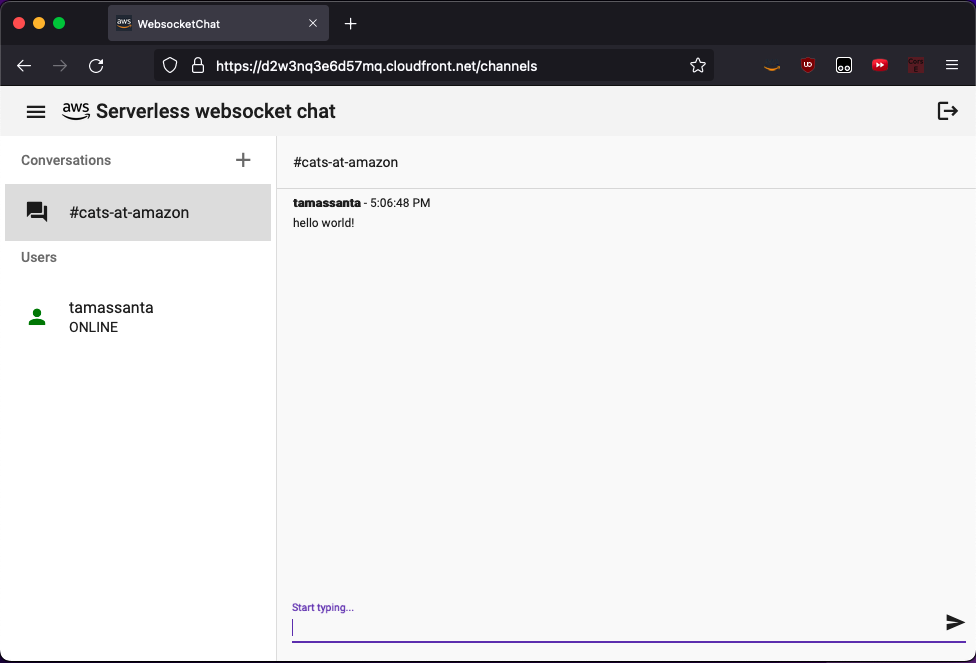
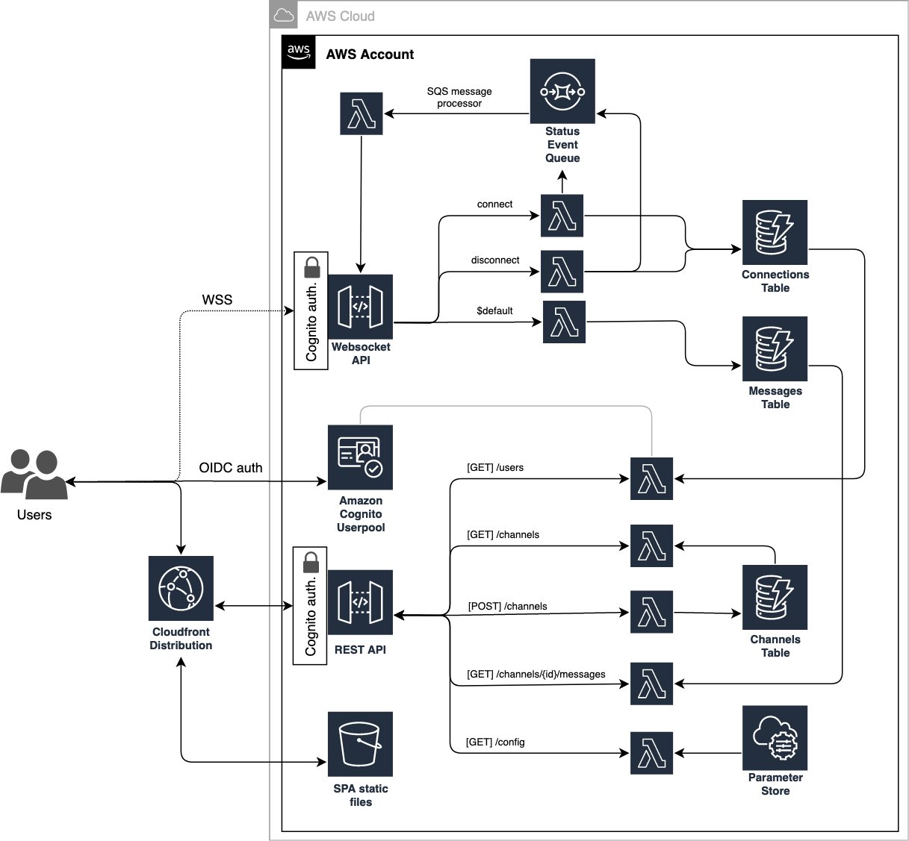
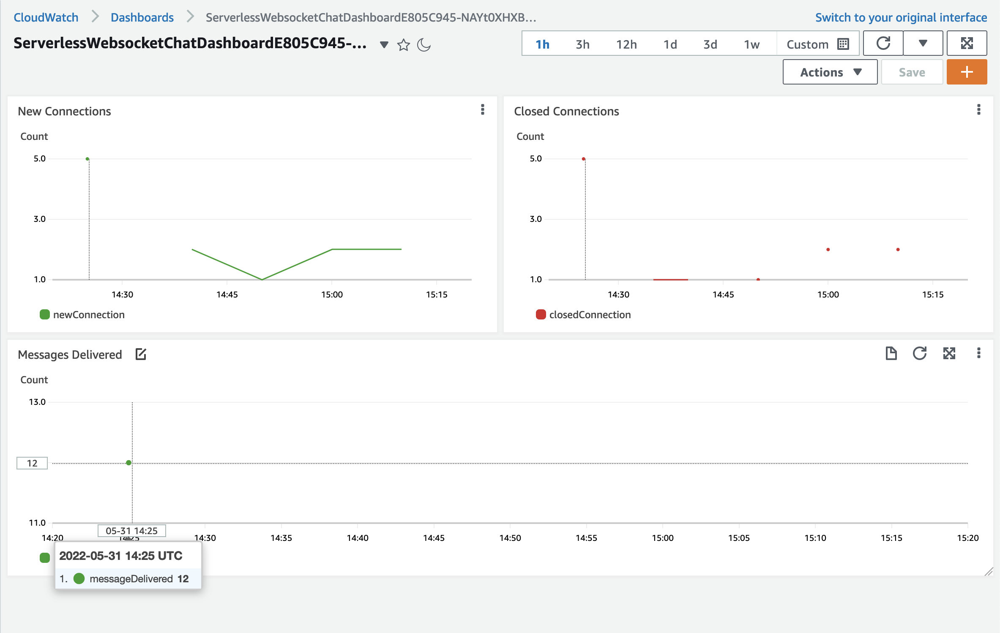
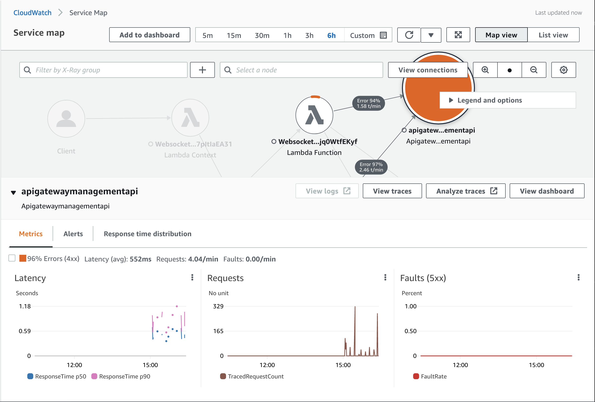

# Serverless chat application using ApiGateway Websockets
This project lets you provision a ready-to-use fully serverless real-time chat application using Amazon ApiGateway Websockets. The infrastructure code is using the [AWS Cloud Development Kit(AWS CDK)](https://aws.amazon.com/cdk/) and implemented in both Typescript and NET8. The frontend is written using [Angular 17](https://angular.io/).



:warning: WARNING :warning: The NET8 implementation is still work-in-progress, however it should work as-is and has the same security features implemented as the Typescript version. Below you can find a breakdown of feature implementation state.

## Features
| TS | NET8 | Feature description |
| :---: | :---: | :--- |
| :white_check_mark: | :white_check_mark: | "One-click" serverless deployment using [AWS CDK](https://aws.amazon.com/cdk/) | 
| :white_check_mark: | :white_check_mark: | Infrastructure is split into 6 interdependent stacks (Authorization, Database, REST API, Websocket API, Frontend, Observability)
| :white_check_mark: | :white_check_mark: | Secure HTTPS connection and content delivery using [Amazon Cloudfront](https://aws.amazon.com/cloudfront/)
| :white_check_mark: | :white_check_mark: | Built-in authentication using [Amazon Cognito](https://aws.amazon.com/cognito/)
| :white_check_mark: | :white_check_mark: | Built-in REST API authorization using Cognito UserPool Authorizer
| :white_check_mark: | :white_check_mark: | Synchronous real-time messaging using [API Gateway Websocket API](https://docs.aws.amazon.com/apigateway/latest/developerguide/apigateway-websocket-api.html)
| :white_check_mark: | :white_check_mark: | Asynchronous user status updates using [Amazon SQS](https://aws.amazon.com/sqs/) and API Gateway Websocket API
| :white_check_mark: | :white_check_mark: | Environment-agnostic Single Page Application frontend (dynamic environment configuration loading)
| :white_check_mark: | :white_check_mark: | Complete request tracing using [AWS X-Ray](https://aws.amazon.com/xray/)
| :white_check_mark: | :white_check_mark: | Lambda Powertools integration
| :white_check_mark: | :white_check_mark: | Structured logging and monitoring using [Amazon Cloudwatch](https://aws.amazon.com/cloudwatch/)
| :white_check_mark: | :white_check_mark: | Custom metrics & Cloudwatch dashboard
| :white_check_mark: | :x: | Built-in infrastructure security check using [CDK-NAG](https://github.com/cdklabs/cdk-nag)


## Solution Overview


## Project structure
The infrastructure backend has been split into two directories (`infrastructure-ts`, `infrastructure-dotnet`). These folders contain language-specific implementations for *both* the AWS CDK code and the lambda handlers. Please read the Readme file in the relevant directory for specific deployment instructions.

## Prerequisites

- [AWS CLI](https://aws.amazon.com/cli/) installed and configured with the aws account you want to use.
- [AWS CDK](https://docs.aws.amazon.com/cdk/latest/guide/getting_started.html) installed and configured with the aws account you want to use.
- [docker](https://docs.docker.com/get-docker/) installed and is up and running locally (required for the lambda function builds).
- [Angular CLI](https://angular.io/cli) installed.
- [dotnet8](https://dotnet.microsoft.com/en-us/download/dotnet/8.0) installed (for the NET8 infrastructure version)

## Security considerations
For the sake of this demo, **not all security features are enabled** to save cost and effort of setting up a working PoC. 

Below you can find a list of security recommendations in case you would like to deploy the infrastructure in a production environment:
- Currently **all registered users can immediately access** the application without second factor authentication or account confirmation. This is not suitable for production use. Please change the Cognito configuration to enable e-mail/sms verification and MFA. In a future release this will be addressed with a feature flag to toggle between different authentication modes.
- The DynamoDB tables have no backups configured by default. Please enable PITR (point-in-time recovery) and table backups. The tables will be removed on cloudformation stack deletion.
- Logging for the APIGateway API/stage and for the Cloudfront distribution are disabled. Please enable these additional logs in production environments for audit and troubleshooting purposes.
- The Cloudfront distribution uses the default cloudfront domain and viewer certificate. The default viewer certificate defaults to the TLSv1 protocol. In order to enforce newer protocols, please use a custom domain with a custom certificate and set the MinimumProtocolVersion to TLSv1.2.

## Getting started
### Deployment

:warning: WARNING :warning: The domain prefix for the Cognito Userpool needs to be *globally unique*. Before deployment, please make sure to configure your unique domain prefix at the FrontendStack declaration.

For language specific instructions, please check the readme file in the related infrastructure directory.

- [Typescript](./infrastructure-ts/README.md)
- [NET8](./infrastructure-dotnet/README.md)

### [Optional] - Building the frontend
- Change directory to where UI code lives.
```bash
    cd UI
```
- Restore NPM packages for the project
```bash
    npm install
```
- Build the frontend application
```bash
    ng build --prod
```

### Opening the chat application
The chat application's URL will be found at the Frontend stack's output. Open the Cloudfront Distribution's URL in your browser, where you'll be redirected to the Cognito login/singup page. 

### Cleanup
Run the following command in the relevant infrastructure directory to delete the cloudformation stacks:
```bash
    cdk destroy --all
```

## Observability
The backend is fully instrumented using AWS Xray and Lambda Powertools for TypeScript (beta).

### Custom Metrics & Cloudwatch Dashboard
The backend outputs 3 custom metrics from the websocket API backend:
* New Connections
* Closed Connections
* Messages Delivered

The **Observability Stack** ([TS](./infrastructure-ts/lib/observability-stack.ts) / [NET8](./infrastructure-dotnet/src/Infrastructure/Stacks/ObservabilityStack.cs)) creates a custom Cloudwatch Dashboard where these metrics are visualised.



### AWS X-Ray and ServiceMap integration
Requests are automatically traced and instrumented using [AWS X-Ray](https://aws.amazon.com/xray/). You can use the ServiceMap to visualise the interactions between the backend components and trace latencies, response codes, etc. between these components.




## API Handler documentation
You can find a more detailed description of what the API handler functions are doing [here](/infrastructure-ts/resources/handlers/README.md).

## Found an issue? Anything to add?
See [CONTRIBUTING](CONTRIBUTING.md#security-issue-notifications) for more information.

## License

This library is licensed under the MIT-0 License. See the LICENSE file.
